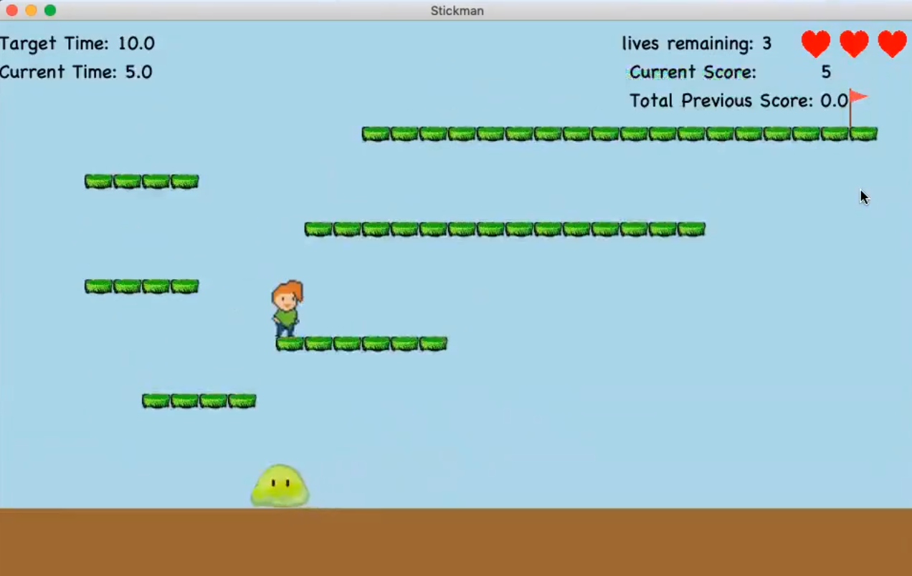

# Retro Game
Players need to operate the character to pass designed maps and challenges. This project
employs Python, Java programming, and software design patterns.

## HOW TO RUN
Type gradle run in the terminal

## How to shoot
Press SPACE

